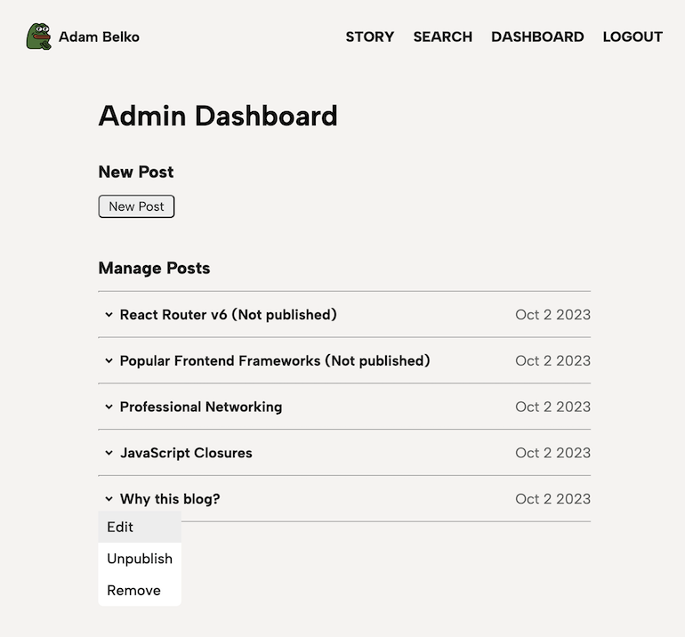
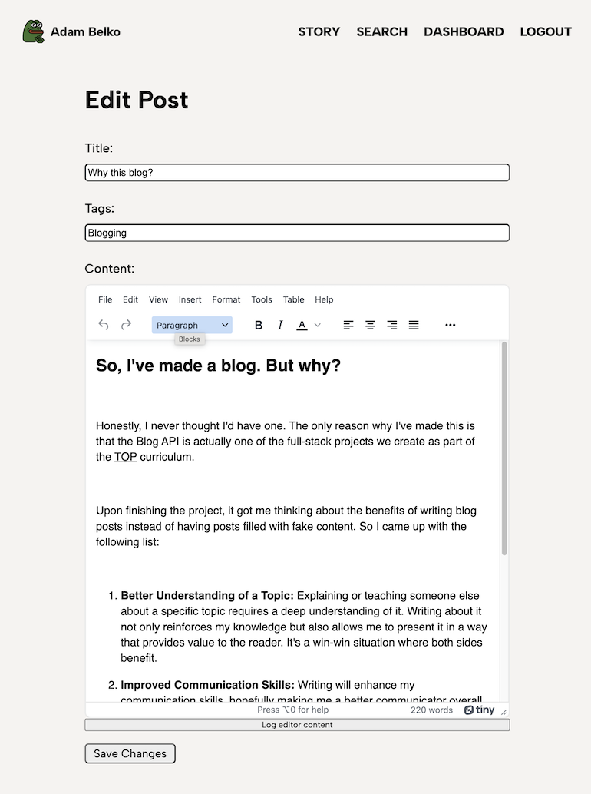

# Blog API

<a href="https://www.adambelko.com">www.adambelko.com</a>
Web application built with a RESTful API, featuring admin authentication, a custom Content Management System (CMS), and seamless integration between frontend and backend providing a dynamic and intuitive user experience.

## Key Features

1. **RESTful Architecture:** Built a RESTful API using Node.js and Express to facilitate data retrieval and manipulation between client and server. This is done through standardized HTTP methods allowing for efficient communication.

2. **User Authentication and Authorization:** The backend features an auth routes that handles user registration, login, and logout. The app utilizes PassportJS with local and JWT strategies to handle auth flow. Throughout the app, auth middleware are used to ensure only authenticated and authorized users can perform special actions or access protected routes within the API.

3. **JWT Issuance for Login Persistence:** Upon login, the server issues a refresh token and an access token to be handled by the frontend. These tokens are signed with a RSA private key, to be verified later on with a RSA public key. These tokens are used by the auth middleware to handle requests in the API's protected routes.

4. **Custom CMS:** Developed a tailored Content Management System that offers an intuitive interface for tasks like creating, editing, adjusting publicity, and deleting blog posts.

5. **Integration with the Frontend:** Developed a dynamic user interface using JavaScript, React, and various libraries to ensure an intuitive experience. Seamlessly integrated with the backend, enabling real-time data synchronization and efficient communication between the client and server

## Content Management System (CMS)

